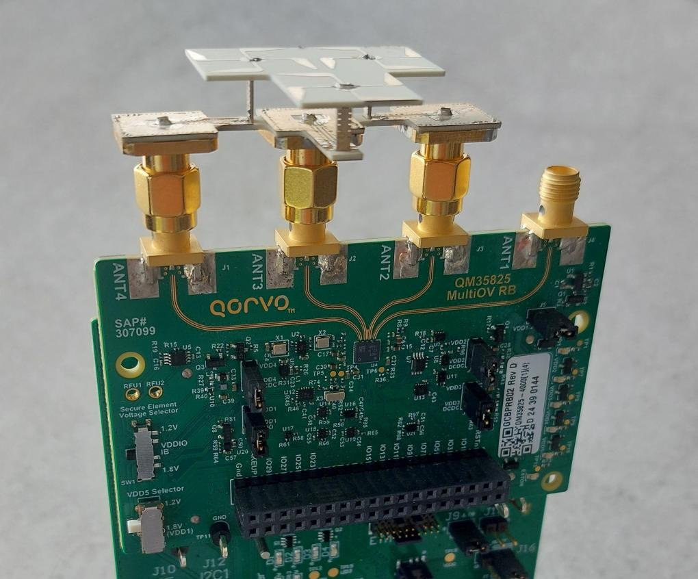
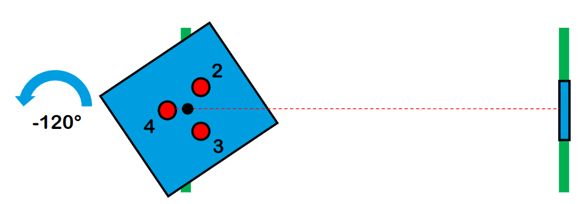
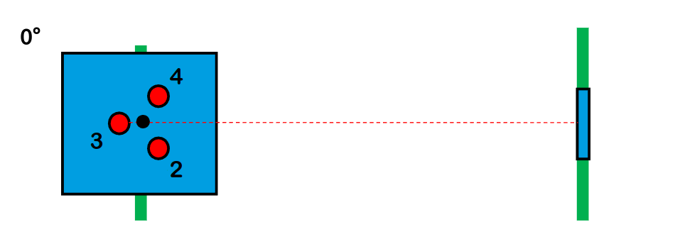
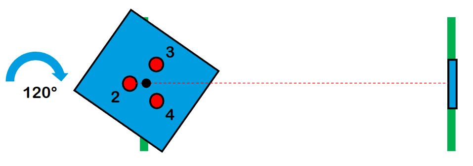
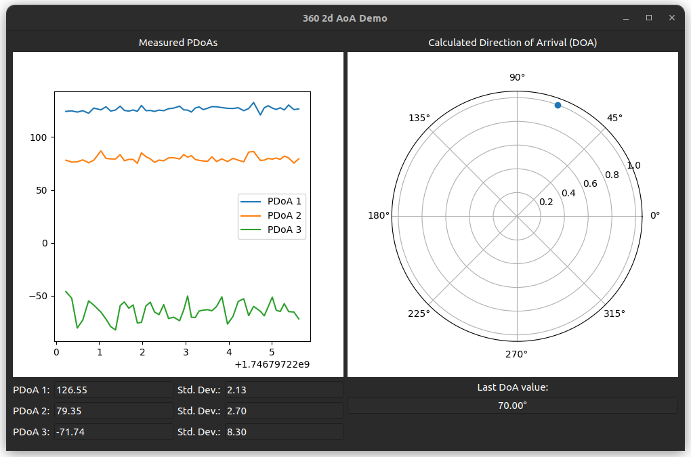

# 360_2d_aoa

This script demonstrate 360° 2D AoA (Angle of Arrival) use case.

> **Important:** This example requires **Torus antennas** which are **not included** in the QM35825DK-05 kit. In order to obtain them, please contact [Qorvo sales](https://www.qorvo.com/support/how-to-buy/contact-a-sales-rep).

## How to achieve 360° 2D AoA measurements using 2 DUTs

Several steps need to be done in order to get the measurements:
 - Two QM35825DK-05 kits are required.
 - Specific Torus antennas need to be used.
 - Antenna configuration in PDoA mode 6.
 - Proper antenna pairs offset need to be calibrated to match the provided PDoA LUT.
 - TWR session needs to be established between the devices with diagnostics data enabled to obtain raw PDoA data.
 - During the ranging session logs are collected and diagnostics data is stored into the file.
 - Later, log file is parsed and raw PDoA values (for each antenna pair) are extracted to the ndarray.
 - This ndarray can be than used as an input to the script that is presenting raw PDoA data together with calculated 2D AoA.
 - 2D AoA is calculated using PDoA LUT:
     - `torus_lut.npz` -LUT obtained by series of measurements done for different angles in controlled environment.

Steps are described in the details further in the document.

### HW setup

**Torus** antenna shall be connected to both devices. Correct connection is shown on the pictures below:



### Load board calibration

Argument `-l` created for `fira_360_aoa` script to load proper calibration for AoA measurement.

| Parameter                | Values                            |
|--------------------------|-----------------------------------|
| -l / --load-calibration  | Load calibration mode.            |
| -p / --port              | Specify communication interface.  |

Run this command to load calibration to both controller and controlee:

```
fira_360_aoa -l -p <port>
```

> **Note:** Please note that this file will load the calibration with either default offset values, or previous ones if you already performed offset calibration


### Antenna offset calibration

Argument `-c` created for `fira_360_aoa` script to perform offset calibration. In this mode a series of measurements is performed
for three different antenna pairs to calculate antenna pairs offsets and later downloads calibration file to the device.

| Parameter        | Values                                                               |
|------------------|----------------------------------------------------------------------|
| -c / --calibrate | Use calibration mode.                                                |
| -p / --port      | Specify communication interface.                                     |
| -ch / --channel  | Channel (supported values are 5 and 9). default value: 9 (optional). |

In this step, mode 6 calibration needs to be set together with 0.0° calculating and setting offset for each antenna pair.
To correctly perform the calibration you need two devices with Torus antennas with at least 1.5m distance between them.
Then, the following command needs to be executed in the controller device to set proper configuration calibration:

```
fira_360_aoa -c -p <controller_port>
```

The script will display instructions and wait for your actions:

```
Please set your node position to: <angle> degree and click enter, when ready...
```

Put your controller device in one of three positions, according to what was prompted in the terminal:

- **Antenna pair 0: 3 - 2**



- **Antenna pair 1: 4 - 2**



- **Antenna pair 2: 4 - 3**




Press enter, the script will show the following instruction:

```
Run `fira_360_aoa -r -p <controlee_port> -t -1 --controlee` on second terminal and click enter to start calibration...
```

Open second terminal and run the displayed command, then click enter. The script will perform calibration of offset
for the antenna pair and display this message, when it's done:

```
Calibration for controller position: <angle> degree complete! (pdoa_offset: <calculated_offset>)
```

This whole procedure will be repeated for two remaining antenna pairs

When you see following message, it means that calibration was done successfully:

```
Offset calibration done!
```

Now that the board is calibrated, you can proceed to the next step, which is running the measurement

> **Note:** Calculated offset values are witten to the calibration file, so unless you move your setup, you don't have to perform this procedure again

### Running measurement

Argument `-c` created for `fira_360_aoa` script to perform offset calibration. In this mode a TWR session is started between
controller and cotrolee, and the measurement data is saved to the .json file.

> **Note:** Only key parameters mandatory for running the PDoA measurement are presented in following table.

| Parameter               | Values                                                    |
|-------------------------|-----------------------------------------------------------|
| -r / --run-measurement  | Use measurement mode.                                     |
| -p / --port             | Specify communication interface.                          |
| -ch / --channel         | Channel (supported values are 5 and 9). default value: 9. |
| -t / --time             | Measurement time in seconds. default value: 100.          |

Use 2 different terminals, one for each device. The first one will act as the controller and the second one as the controlee.

Run controller:
```
run_fira_twr -r -p <controller_port>
```

and controlee:
```
run_fira_twr -r -p <controlee_port> --controlee
```

Wait for the measurement to end. A `diagnostic_data_<date>-<time>.json` file will be created

### Display AoA measurements

Log recorded in measurement mode can be used to display the 2D AoA value. To see the graphical output run the `fira_360_aoa`
script with `-d` option and log file (cf) as an argument.

| Parameter        | Values                       |
|------------------|------------------------------|
| -d / --display   | Use display mode.            |
| -lf / --log-file | Refer to the JSON log file.  |

```
fira_360_aoa -d -lf <log_file.json>
```

New window will pop-up that is presenting static raw data. When closed, another window with animation
will appear. To stop the script just close the window:


